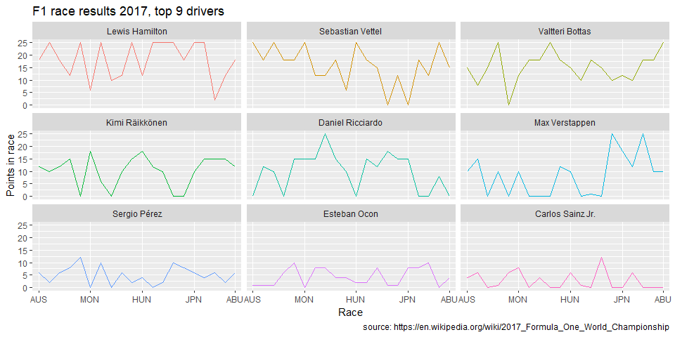

HW1
================

My past programming and computer science experience
---------------------------------------------------

When it comes to the use of R, RStudio and its various libraries such as ggplot2 and dplyr, my experience is limited. I have only used R in the Statistical Analysis MT4001 course where the programming was very much a *copy, paste and modify* exercise.

However, I have taken the courses in computer science for mathematicians where we used Python, Git and wrote UNIX scripts. Therefore, I am somewhat comfortable with programming in general (datastructures and algorithms) and I know how to use Git and its workflow, as well as the command line.

Using ggplot on a data set
--------------------------

Since I am interested in Formula 1, I thought that it would be fun to use a dataset related to Formula 1. F1 is a data driven sport so it is easy to come by datasets. However, many of the datasets that I have found are very large, such as the one found on [Kaggle](https://www.kaggle.com/cjgdev/formula-1-race-data-19502017/version/1). Instead of using a large dataset which most likely would require a lot of data wrangling, I chose to create my own. Since I am not to familiar with the tools for web scarping in R I decided to simply copy a table of the [World Championchip standing of 2017 from Wikipedia](https://en.wikipedia.org/wiki/2017_Formula_One_World_Championship). I then saved the table as a **.csv** using Excel.

### Data wrangling

I will first start by doing some cleaning and transformation of dataset so it will be nice and easy to then create visualizations.

``` r
library(tidyverse) # For plotting and data wrangling
```

    ## -- Attaching packages --------------------------------------------------------------------------------- tidyverse 1.2.1 --

    ## v ggplot2 3.1.0     v purrr   0.2.5
    ## v tibble  1.4.2     v dplyr   0.7.7
    ## v tidyr   0.8.2     v stringr 1.3.1
    ## v readr   1.1.1     v forcats 0.3.0

    ## -- Conflicts ------------------------------------------------------------------------------------ tidyverse_conflicts() --
    ## x dplyr::filter() masks stats::filter()
    ## x dplyr::lag()    masks stats::lag()

``` r
# Read dataset from .csv
f1 <- read.csv('C:/Users/MaPa/Desktop/Jacob/MT5013/Homework/HW1/f1_2017.csv', 
                    header = TRUE, 
                    sep = ';', 
                    encoding = 'UTF-8')

f1 <- f1[-1,]  # Drop first row
colnames(f1)[c(1)] <- c('Pos') # Change column name
race_vector <- colnames(f1)[3:22] # Save order of races to a vector


f1_long <- gather(f1, Race, Race_position, AUS:ABU) # Create long dataframe
```

    ## Warning: attributes are not identical across measure variables;
    ## they will be dropped

``` r
f1_long <- filter(f1_long, Pos != '') # Drop observations where driver did not race


# Create table to substitue position for points
Race_position <- c(seq(1, 25), 'Ret', 'DNS')
Points_race <- c(25, 18, 15, 12, 10, 8, 6, 4, 2, 1, rep(0, 17))
pos_points_df <- data.frame(Race_position, Points_race)

# Merge data and create tibble
f1_2017 <- as_tibble(merge
                     (x = f1_long,
                      y = pos_points_df, 
                      by = 'Race_position')
                     )

# Make measure factors and order them
f1_2017$Race <- as.factor(f1_2017$Race)
f1_2017$Race <- factor(f1_2017$Race, levels = race_vector)
f1_2017$Race_position <- as.factor(f1_2017$Race_position)
f1_2017$Race_position <- ordered(f1_2017$Race_position, levels = c(seq(1:25), 'Ret', 'DNS'))
f1_2017$Driver <- reorder(f1_2017$Driver, -f1_2017$Points)

# Filter the 9 best driver for Visualization
f1_top9 <- f1_2017 %>% filter(Pos %in% c(seq(1, 9)))
```

### Visualization

Now we have a small dataset that we can visualize. Let us look at the race results for the top 9 drivers of the year.

``` r
ggplot(f1_top9, aes(x = Race, y = Points_race, group = Driver, color = Driver)) +
    geom_line(show.legend = FALSE) +
    facet_wrap(~Driver, nrow = 3) +
    scale_x_discrete(breaks = c("AUS", "MON", "HUN", "JPN", "ABU")) +
    ylab("Points in race") +
    labs(title = "F1 race results 2017, top 9 drivers",
       caption = "source: https://en.wikipedia.org/wiki/2017_Formula_One_World_Championship")
```



``` r
sessionInfo()
```

    ## R version 3.5.1 (2018-07-02)
    ## Platform: x86_64-w64-mingw32/x64 (64-bit)
    ## Running under: Windows 10 x64 (build 17134)
    ## 
    ## Matrix products: default
    ## 
    ## locale:
    ## [1] LC_COLLATE=Swedish_Sweden.1252  LC_CTYPE=Swedish_Sweden.1252   
    ## [3] LC_MONETARY=Swedish_Sweden.1252 LC_NUMERIC=C                   
    ## [5] LC_TIME=Swedish_Sweden.1252    
    ## 
    ## attached base packages:
    ## [1] stats     graphics  grDevices utils     datasets  methods   base     
    ## 
    ## other attached packages:
    ##  [1] bindrcpp_0.2.2  forcats_0.3.0   stringr_1.3.1   dplyr_0.7.7    
    ##  [5] purrr_0.2.5     readr_1.1.1     tidyr_0.8.2     tibble_1.4.2   
    ##  [9] ggplot2_3.1.0   tidyverse_1.2.1
    ## 
    ## loaded via a namespace (and not attached):
    ##  [1] Rcpp_0.12.19     cellranger_1.1.0 pillar_1.3.0     compiler_3.5.1  
    ##  [5] plyr_1.8.4       bindr_0.1.1      tools_3.5.1      digest_0.6.18   
    ##  [9] lubridate_1.7.4  jsonlite_1.5     evaluate_0.12    nlme_3.1-137    
    ## [13] gtable_0.2.0     lattice_0.20-35  pkgconfig_2.0.2  rlang_0.3.0.1   
    ## [17] cli_1.0.1        rstudioapi_0.8   yaml_2.2.0       haven_1.1.2     
    ## [21] withr_2.1.2      xml2_1.2.0       httr_1.3.1       knitr_1.20      
    ## [25] hms_0.4.2        rprojroot_1.3-2  grid_3.5.1       tidyselect_0.2.5
    ## [29] glue_1.3.0       R6_2.3.0         readxl_1.1.0     rmarkdown_1.10  
    ## [33] modelr_0.1.2     magrittr_1.5     backports_1.1.2  scales_1.0.0    
    ## [37] htmltools_0.3.6  rvest_0.3.2      assertthat_0.2.0 colorspace_1.3-2
    ## [41] labeling_0.3     stringi_1.2.4    lazyeval_0.2.1   munsell_0.5.0   
    ## [45] broom_0.5.0      crayon_1.3.4
