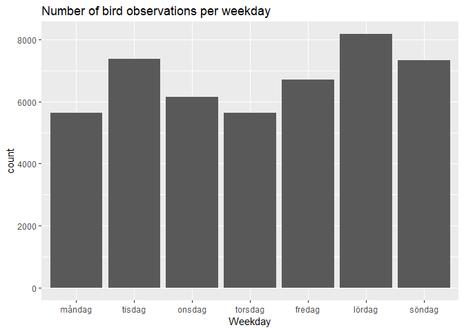
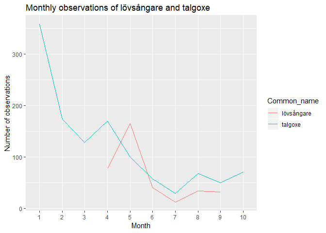
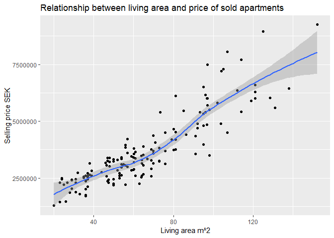
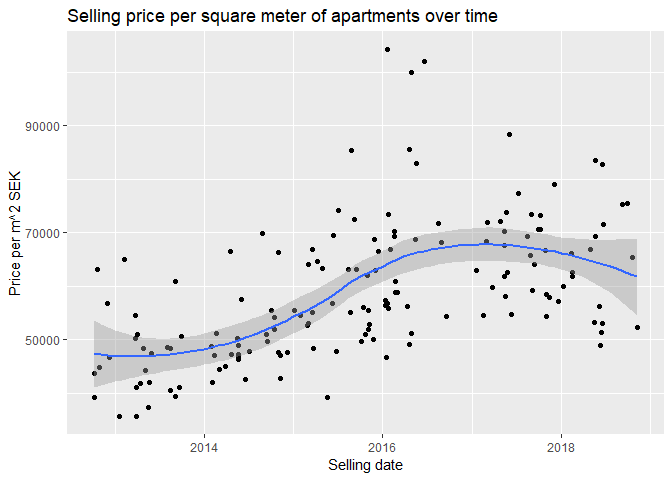
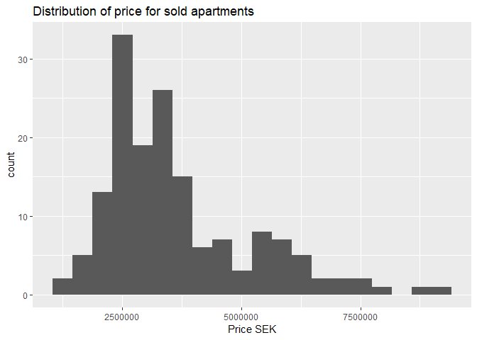
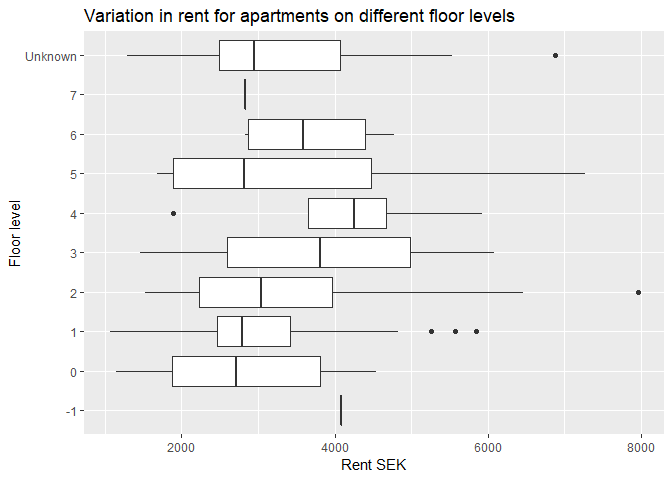

HW2
================
2018-11-12

Birdwatching
============

We start by loading the tidyverse library and loading the bird dataset.

``` r
#Import tidyverse library
library(tidyverse)

#Load data ---------------------------
species_data <- read_csv("../HW_data/SpeciesObservations-2018-11-07-14-23-54.csv")
```

### Data cleaning

We will begin by doing some quick data cleaning.

``` r
#Clean data --------------------------
#Replace spaces in variable names with underscore
names(species_data) <- gsub(" ", "_", names(species_data))

#Change "Start"" and "End" variables to date datatype
species_data <- mutate(species_data, 
                      Start = as.Date(Start, "%d/%m/%Y"),
                      End = as.Date(End, "%d/%m/%Y")
                      )

#Create new variable "Date" for observation date
species_data <- mutate(species_data, Date = Start)
```

### Tasks

The first task is to list the number of observations of each bird species in January and July respectively

``` r
#Filter out birds
bird_data <- species_data %>% filter(Organism_group == "Fåglar")

#Count the number of observations per species in January and sort them
jan_n_bird <- bird_data %>% filter(months(Date) == "januari") %>%
  group_by(Common_name) %>%
  summarise(Observations = n()) %>%
  arrange(desc(Observations), Common_name)

#Count the number of observations per species in July and sort them
jul_n_bird <- bird_data %>% filter(months(Date) == "juli") %>%
  group_by(Common_name) %>%
  summarise(Observations = n()) %>%
  arrange(desc(Observations), Common_name)

#Create table with the 10 most commonly observed species in January
jan_table <- head(jan_n_bird, 10) %>% knitr::kable(col.names = c("Species", "Count"))
  
#Create table with the 10 most commonly observed species in July
jul_table <- head(jul_n_bird, 10) %>% knitr::kable(col.names = c("Species", "Count")) 
```

#### Ten most commonly observed species in January

| Species         |  Count|
|:----------------|------:|
| koltrast        |    443|
| talgoxe         |    358|
| blåmes          |    356|
| björktrast      |    297|
| skata           |    297|
| gråsparv        |    248|
| gräsand         |    238|
| mindre korsnäbb |    234|
| gråtrut         |    221|
| nötskrika       |    220|

#### Ten most commonly observed species in July

| Species     |  Count|
|:------------|------:|
| koltrast    |     76|
| silltrut    |     73|
| ringduva    |     67|
| tornseglare |     66|
| steglits    |     56|
| sothöna     |     49|
| fiskmås     |     46|
| stare       |     45|
| grönfink    |     42|
| rödhake     |     42|

The next task is to visualize the number of observations for each weekday

``` r
#Create weekday order vector
weekday_order <- c("måndag", "tisdag", "onsdag", "torsdag", "fredag", "lördag", "söndag")

#Create new variable weekday and reorder factor
bird_data <- bird_data %>% mutate(Weekday = weekdays(Date))
bird_data$Weekday <- factor(bird_data$Weekday, weekday_order)

# Create plot
bird_data %>% ggplot(aes(Weekday)) +
  geom_bar() +
  labs(title = "Number of bird observations per weekday")
```



Most observations of birds happen on Saturdays and Sundays. Naturally there are not any more birds out flying on the weekend but the bird watchers have time off from work to observe birds and report those observations. Apparently Tuesday is also a popular day for bird watchers to take some time off work.

The Willow Warbler is one of the most common migratory birds is Sweden. We are know going to list the first five unique observers (by date then name) of the bird.

``` r
#Create new data frame with unique observers sorted by date
observers_by_date <- bird_data %>% filter(Scientific_name == "Phylloscopus trochilus") %>%
  select(Recorded_by, Date) %>%
  arrange(Date, Recorded_by) %>%
  group_by(Recorded_by) %>%
  filter(row_number() == 1)
  
#Create table of five first unique observers
head(observers_by_date, 5) %>% knitr::kable(caption = "First five unique observers")
```

| Recorded\_by             | Date       |
|:-------------------------|:-----------|
| Maud Tyboni, Jon Sjöberg | 2018-04-15 |
| Hans Norelius            | 2018-04-17 |
| Ola Sångberg             | 2018-04-19 |
| Anders Tranberg          | 2018-04-20 |
| Johan Cavalli            | 2018-04-20 |

It is worth noting that there were multiple sightings of the Willow Warbler on 2018-04-20 by different observers. However, only two observers (alphabetically sorted by name) are listed in the table above.

The final bird related task is to plot the monthly number of observations for "Lövsångare" and "talgoxe", two common Swedish birds.

``` r
#Order of months used as factor levels
months_order = c("januari", "februari", "mars", "april",
                 "maj", "juni", "juli", "augusti",
                 "september", "oktober", "november", "december")

#Filter and summarise data frame
bird_n_month <- bird_data %>% filter(Common_name %in% c("lövsångare", "talgoxe")) %>%
  mutate(Month = factor(months(Date), levels = months_order)) %>%
  select(Common_name, Month) %>%
  group_by(Common_name, Month) %>%
  summarise(n_month = n())

#Plot number of observations for "lövsångare" and "talgoxe" per month
bird_n_month %>% ggplot(aes(Month, n_month, group = Common_name, color = Common_name)) +
  geom_line() +
  scale_x_discrete(labels = c(seq(1, 12))) +
  ylab("Number of observations") +
  labs(title = "Monthly observations of lövsångare and talgoxe")
```



The "Talgoxe" is most commonly observed in the winter (January in particular). Meanwhile the "Lövsångare" is only observed from April and forward, the likely reason for this is that it is a migratory bird which spends the winter somewhere else.

Apartment prices
================

In the next section of homework 2 we will look at apartment prices. Let us begin by loading some data.

``` r
# Load data ---------------------------
apartment_data <- read_csv("../HW_data/booli_sold.csv")
```

### Tasks

The first task is to plot the relationship between the living area of homes and their selling price.

``` r
#Plot relationship between living area and selling price
ggplot(apartment_data, aes(livingArea, soldPrice)) +
  geom_point() +
  geom_smooth() +
  labs(title = "Relationship between living area and price of sold apartments") +
  xlab("Living area m^2") +
  ylab("Selling price SEK")
```



We see that there is a strong relationship between living area and selling price. Buyers are in general willing to pay more for more living space. Next we will look at the price per square meter of apartments over time.

``` r
#Plot price per square meter over time
apartment_data %>% mutate(PricePerM2 = soldPrice / livingArea) %>%
  ggplot(aes(soldDate, PricePerM2)) +
  geom_point() +
  geom_smooth() +
  labs(title = "Selling price per square meter of apartments over time") +
  xlab("Selling date") +
  ylab("Price per m^2 SEK")
```



From the plot we can see that the price per square meter increased from the start of the timeseries until the beginning of 2017. From 2017 to the end of the timeseries the price per square meter had a slightly decreasing trend.

Next let us look at the distribution of the apartment prices in the dataset. We will do this with an histogram.

``` r
ggplot(apartment_data, aes(soldPrice)) +
  geom_histogram(bins = 20) +
  labs(title = "Distribution of price for sold apartments") +
  xlab("Price SEK")
```



In the next plot, we will use a boxplot to look at the variation in rent for apartments on different floor levels.

``` r
#Plot boxplot for rent on different floor levels
apartment_data %>% select(rent, floor) %>%
  mutate(floor = replace_na(floor, "Unknown")) %>%
  ggplot(aes(floor, rent)) +
  geom_boxplot() +
  coord_flip() +
  ylab("Rent SEK") +
  xlab("Floor level")+
  labs(title = "Variation in rent for apartments on different floor levels")
```



To end the homework we will create tables for the five most expensive apartments to live in and five least expensive apartments to live in respectively, assuming that the buyer has to borrow 70 % at a 1.5 % interest rate. We will include columns for cost of living, price, rent, size, rooms and street adress.

``` r
# Create new tibble
apartment_costofLiving <- apartment_data %>% mutate(costofLiving = 0.7 * soldPrice * 0.015/12 + rent) %>%
  select(costofLiving, soldPrice, rent, livingArea, rooms, location.address.streetAddress)

# Table apartments with highest cost per month
table_most_exp <- apartment_costofLiving %>% 
  arrange(desc(costofLiving)) %>%
  head(n = 5) %>%
  knitr::kable(col.names = c("Cost per month", "Price", "Rent", 
                             "Living area m^2", "Rooms", "Street adress"))

# Table apartments with lowest cost per month
table_least_exp <- apartment_costofLiving %>% 
  arrange(costofLiving) %>%
  head(n = 5) %>%
  knitr::kable(col.names = c("Cost per month", "Price", "Rent", 
                             "Living area m^2", "Rooms", "Street adress"))
```

#### Apartments with highest cost to live in

|  Cost per month|    Price|  Rent|  Living area m^2|  Rooms| Street adress    |
|---------------:|--------:|-----:|----------------:|------:|:-----------------|
|        13941.75|  9250000|  5848|              152|      5| Torphagsvägen 22 |
|        13754.25|  8950000|  5923|              125|      4| Torphagsvägen 4  |
|        13605.75|  6450000|  7962|              138|      6| Torphagsvägen 6  |
|        12825.50|  7700000|  6088|              114|      5| Torphagsvägen 14 |
|        12168.00|  5600000|  7268|              131|      5| Åminnevägen 15   |

#### Apartments with lowest cost to live in

|  Cost per month|    Price|  Rent|  Living area m^2|  Rooms| Street adress   |
|---------------:|--------:|-----:|----------------:|------:|:----------------|
|        2340.750|  1450000|  1072|               23|    1.0| Åminnevägen 17  |
|        2431.500|  1300000|  1294|               20|    1.0| Ekhagsvägen 10  |
|        2678.625|  1475000|  1388|               26|    1.0| Ekhagsvägen 12  |
|        3077.750|  2210000|  1144|               25|    1.0| Torphagsvägen 4 |
|        3303.375|  1885000|  1654|               31|    1.5| Ekhagsvägen 12  |

**In the tables it is assumed that the buyer has to borrow 70 % of the apartment price at 1.5 % interest rate.**
