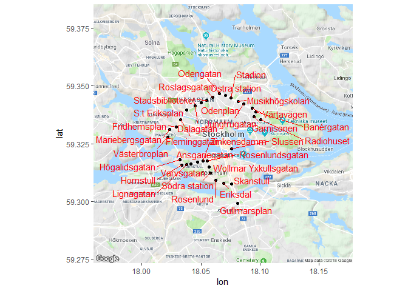

HW3
================

``` r
# Load tidyverse, ggmap and ggrepel to avoid text overlap
library(tidyverse)
library(ggmap)
library(ggrepel)
```

Long and wide at Statistics Sweden
==================================

We will first illustrate something that is easier to do when the data is in long and tidy format rather than wide format. Suppose we have a dataset like our `born` or `deaths` below. While it certainly is easier to visually compare the data within each municipality over time it becomes messy when we want to join two or multiple dataset where the years are presented as variables (columns).

``` r
# Load data........................................ 
born <- read_csv("Born.csv", skip = 2)  # Children born (living) in each municipality, 2012-2017
deaths <- read_csv("Deaths.csv", skip = 2)  # Deaths in each municipality, 2012-2017
look_born <- head(born, 4) %>% knitr::kable()
look_deaths <- head(deaths, 4) %>% knitr::kable()
```

#### Look at first rows of`born`

| region              |  2012|  2013|  2014|  2015|  2016|  2017|
|:--------------------|-----:|-----:|-----:|-----:|-----:|-----:|
| 0114 Upplands Väsby |   497|   550|   485|   518|   512|   559|
| 0115 Vallentuna     |   393|   381|   359|   360|   357|   348|
| 0117 Österåker      |   423|   371|   415|   398|   435|   438|
| 0120 Värmdö         |   433|   430|   426|   439|   463|   431|

#### Look at first rows of `deaths`

| region              |  2012|  2013|  2014|  2015|  2016|  2017|
|:--------------------|-----:|-----:|-----:|-----:|-----:|-----:|
| 0114 Upplands Väsby |   264|   265|   318|   287|   305|   294|
| 0115 Vallentuna     |   170|   180|   176|   196|   162|   208|
| 0117 Österåker      |   262|   251|   263|   289|   293|   296|
| 0120 Värmdö         |   222|   211|   261|   270|   250|   242|

Before joining the data we first want to convert it to long format

``` r
# Gather data
born_long <- born %>% gather(`2012`:`2017`, key = "år", value = "födda")
deaths_long <- deaths %>% gather(`2012`:`2017`, key = "år", value = "döda")
look_born_long <- head(born_long, 4) %>% knitr::kable()
look_deaths_long <- head(deaths_long, 4) %>% knitr::kable()
```

Now we can see that the data is instead in long format with `år` as a variable in both datasets.

#### Look at first rows of `born_long`

| region              | år   |  födda|
|:--------------------|:-----|------:|
| 0114 Upplands Väsby | 2012 |    497|
| 0115 Vallentuna     | 2012 |    393|
| 0117 Österåker      | 2012 |    423|
| 0120 Värmdö         | 2012 |    433|

#### Look at first rows of `deaths_long`

| region              | år   |  döda|
|:--------------------|:-----|-----:|
| 0114 Upplands Väsby | 2012 |   264|
| 0115 Vallentuna     | 2012 |   170|
| 0117 Österåker      | 2012 |   262|
| 0120 Värmdö         | 2012 |   222|

Finally we will join the two datasets which is now easy to do.

``` r
# Join datasets (inner_join)
born_death <- inner_join(born_long, deaths_long, by = c("region", "år"))
look_born_death <- head(born_death, 4) %>% knitr::kable()
```

#### Look at first rows of `born_death`

| region              | år   |  födda|  döda|
|:--------------------|:-----|------:|-----:|
| 0114 Upplands Väsby | 2012 |    497|   264|
| 0115 Vallentuna     | 2012 |    393|   170|
| 0117 Österåker      | 2012 |    423|   262|
| 0120 Värmdö         | 2012 |    433|   222|

The final dataset looks as we would expect and it is easy to continue to work on. If the we didn't convert the data to long format the final joined dataset would be a lot messier. Next we will take a long format dataset and show something that is easier to do when the data is in wide format.

We load a dataset `alder` which shows the mean age for men and women in each Swedish region in 2015.

``` r
# Load data........................................
alder <- read_csv("Alder.csv", skip = 2)
look_alder <- head(alder, 4) %>% knitr::kable()
```

#### Look at first rows of `alder`

| region            | kön     |  2015|
|:------------------|:--------|-----:|
| 01 Stockholms län | män     |  38.1|
| 01 Stockholms län | kvinnor |  40.0|
| 03 Uppsala län    | män     |  39.4|
| 03 Uppsala län    | kvinnor |  41.0|

Suppose that we are interested in calculating the difference in mean age between men and women. This can more easily be done if the dataset were in wide format.

``` r
# Convert data to wide format
alder_wide <- alder %>% spread(kön, `2015`)
look_alder_wide <- head(alder_wide, 4) %>% knitr::kable()
```

#### Look at first rows of `alder_wide`

| region               |  kvinnor|   män|
|:---------------------|--------:|-----:|
| 01 Stockholms län    |     40.0|  38.1|
| 03 Uppsala län       |     41.0|  39.4|
| 04 Södermanlands län |     43.4|  41.5|
| 05 Östergötlands län |     42.4|  40.3|

Finally we can now easily create a new column with the difference between women and men in each region.

``` r
# Create new variable diff
alder_diff <- alder_wide %>% mutate(diff = (kvinnor-män))
look_alder_diff <- head(alder_diff, 4) %>% knitr::kable()
```

#### Look at first rows of `alder_diff`

| region               |  kvinnor|   män|  diff|
|:---------------------|--------:|-----:|-----:|
| 01 Stockholms län    |     40.0|  38.1|   1.9|
| 03 Uppsala län       |     41.0|  39.4|   1.6|
| 04 Södermanlands län |     43.4|  41.5|   1.9|
| 05 Östergötlands län |     42.4|  40.3|   2.1|

SL lines
========

The first task is to figure out how the three tables relate to eachother. We begin by loading data and looking at the variables in the datasets.

``` r
# Load data........................................ 
stop_area_data <- read_csv("../HW_data/StopArea.csv")
line_data <- read_csv("../HW_data/Line.csv")
journey_pattern_data <- read_csv("../HW_data/JourneyPattern.csv")

# Look at data
stop_area_data %>% glimpse()
```

    ## Observations: 13,254
    ## Variables: 9
    ## $ StopPointNumber            <int> 10001, 10002, 10003, 10006, 10007, ...
    ## $ StopPointName              <chr> "Stadshagsplan", "John Bergs plan",...
    ## $ StopAreaNumber             <int> 10001, 10002, 10002, 10006, 10006, ...
    ## $ LocationNorthingCoordinate <dbl> 59.33741, 59.33615, 59.33625, 59.33...
    ## $ LocationEastingCoordinate  <dbl> 18.02165, 18.02229, 18.02202, 18.02...
    ## $ ZoneShortName              <chr> "A", "A", "A", "A", "A", "A", "A", ...
    ## $ StopAreaTypeCode           <chr> "BUSTERM", "BUSTERM", "BUSTERM", "B...
    ## $ LastModifiedUtcDateTime    <dttm> 2014-06-03, 2015-09-24, 2015-09-24...
    ## $ ExistsFromDate             <dttm> 2014-06-03, 2015-09-24, 2015-09-24...

``` r
line_data %>% glimpse()
```

    ## Observations: 653
    ## Variables: 6
    ## $ LineNumber               <int> 1, 1, 10, 100, 101, 102, 11, 11, 110,...
    ## $ LineDesignation          <chr> "1", "1", "10", "100", "101", "102", ...
    ## $ DefaultTransportMode     <chr> "blåbuss", "Waxholmsbolagets", "tunne...
    ## $ DefaultTransportModeCode <chr> "BUS", "SHIP", "METRO", "SHIP", "SHIP...
    ## $ LastModifiedUtcDateTime  <dttm> 2007-08-24, 2009-09-02, 2007-08-24, ...
    ## $ ExistsFromDate           <dttm> 2007-08-24, 2009-09-02, 2007-08-24, ...

``` r
journey_pattern_data %>% glimpse()
```

    ## Observations: 26,869
    ## Variables: 5
    ## $ LineNumber                <int> 1, 1, 1, 1, 1, 1, 1, 1, 1, 1, 1, 1, ...
    ## $ DirectionCode             <int> 1, 1, 1, 1, 1, 1, 1, 1, 1, 1, 1, 1, ...
    ## $ JourneyPatternPointNumber <chr> "10008", "10012", "10014", "10016", ...
    ## $ LastModifiedUtcDateTime   <dttm> 2018-02-16, 2012-06-23, 2018-08-20,...
    ## $ ExistsFromDate            <dttm> 2018-02-16, 2012-06-23, 2018-08-20,...

By looking at the three tables we can see how they connect to eachother.

-   `line_data` connects to `journey_pattern_data` through `LineNumber`.
-   `stop_area_data` connects to `journey_pattern_data` through `StopPointNumber` which corresponds to `JourneyPatternPointNumber`.
-   `line_data` does not connect directly to `stop_area_data`.

The next task is to see if `JourneyPatternPointNumber` in `journey_pattern_data` really line up with `StopPointNumber` in `stop_area_data`. To do this we will count the number of unique `JourneyPatternPointNumber` that are not present in the `StopPointNumber` column of `stop_area_data`.

``` r
# Calculate the number of JourneyPatternPointNumber not present in StopPointNumber
num_missmatch <- journey_pattern_data %>%
  filter(!JourneyPatternPointNumber %in% stop_area_data$StopPointNumber) %>%
  distinct(JourneyPatternPointNumber) %>%
  summarise(num = n()) %>%
  pull()
```

By checking we see that there are **`821`** unique `JourneyPatternPointNumber` that are not present in the `StopPointNumber` column of `stop_area_data`.

The next task is to fix this missmatch issue between the two variables in the two tables. If we view the datatables we find that `JourneyPatternPointNumber` always contains five digits while the values of`StopPointNumber` has a varying degree of digits. Furthermore, if we look at the values of `JourneyPatternPointNumber` that are not present in the `StopPointNumber` column we can see that they all have leading zeros. There are no values with leading zeros in `StopPointNumber` at all, so let's fix the missmatch issue by removing the leading zeros in `JourneyPatternPointNumber`.

``` r
# Remove leading zeros in JourneyPatternPointNumber column
journey_pattern_data <- journey_pattern_data %>%
  mutate(JourneyPatternPointNumber = as.integer(JourneyPatternPointNumber))
```

Once we have solved the missmatch problem we will now present a table of the number of active unique bus stops (i.e. bus stops that is in the journey pattern of a line) in each zone (ZoneShortName in StopArea)

``` r
# Create table for the number of unique bus stops per zone
bus_stops_unique <- journey_pattern_data %>% 
  left_join(stop_area_data, by = c("JourneyPatternPointNumber" = "StopPointNumber")) %>%
  mutate(ZoneShortName = replace_na(ZoneShortName, "Unknown")) %>%
  group_by(ZoneShortName) %>%
  distinct(JourneyPatternPointNumber) %>%
  summarize(num = n()) %>%
  knitr::kable(col.names = c("Zone name", "Number of unique bus stops"))
```

### Bus stops per zone

| Zone name |  Number of unique bus stops|
|:----------|---------------------------:|
| A         |                        3539|
| B         |                        3782|
| C         |                        4142|
| Unknown   |                         286|

We are know at the final task. Choose a line, and plot the stops as points (`x = LocationEastingCoordinate, y = LocationNorthingCoordinate`) with the name of each stop as a label (e.g. using `geom_text`). Write the code in such a way that it is easily reusable if you want to plot another line.

Since we have a map of central Stockholm it makes sense to choose a line with stops only in central Stockholm. Let's choose line number 4.

``` r
# Load Stockholm map
load("../HW_data/Stockholm_map.Rdata")

# Choose line for ploting
line_choose <- 4  

# Select line data
bus_line <- journey_pattern_data %>% 
  left_join(stop_area_data, by = c("JourneyPatternPointNumber" = "StopPointNumber")) %>%
  filter(LineNumber == line_choose & DirectionCode == 1) %>%
  rename(lon =  LocationEastingCoordinate,
         lat = LocationNorthingCoordinate)

#Plot on map
ggmap(stockholm) + 
    geom_point(data = bus_line, aes(x = lon, y = lat)) +
    geom_text_repel(data = bus_line, aes(x = lon, y = lat, label = StopPointName),  color = "red") 
```



The map is rather busy but we can see that bus line number 4 operates between Gullmarsplan and Radiohuset with stops in-between. One oddity in the data is that Slussen is a stop on line 4. This is of course not true and we can clearly see on the map that Slussen is not on the route of the other stations but rather in the middle of the map.
