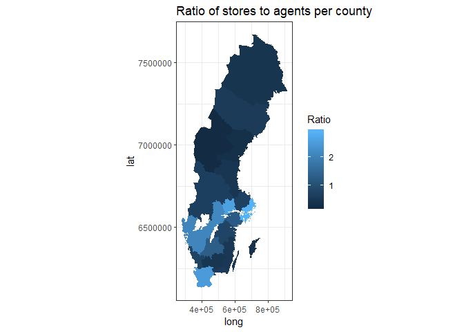
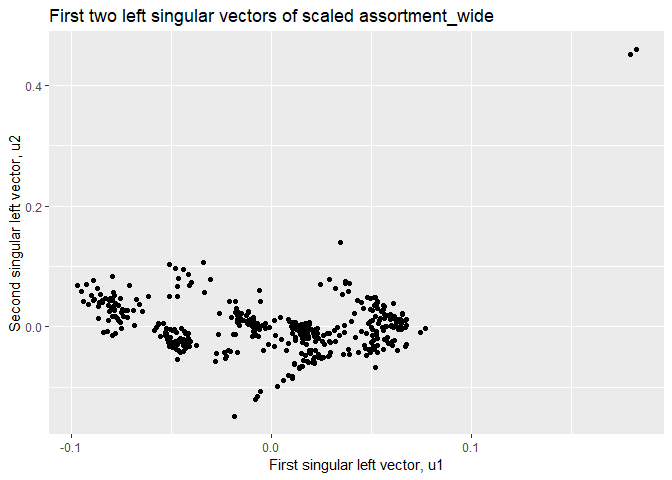
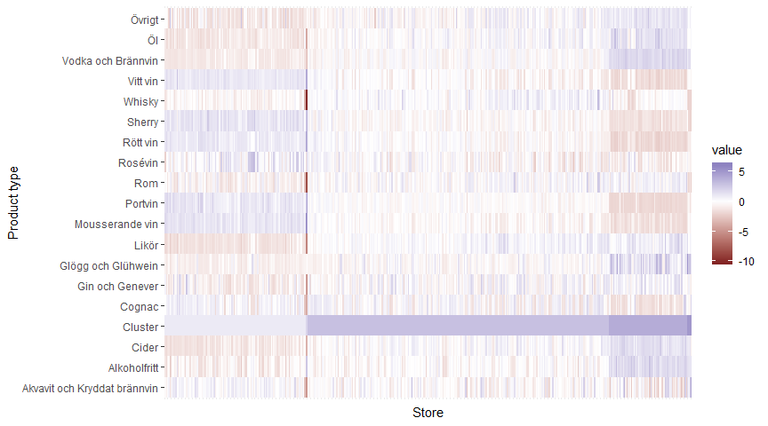
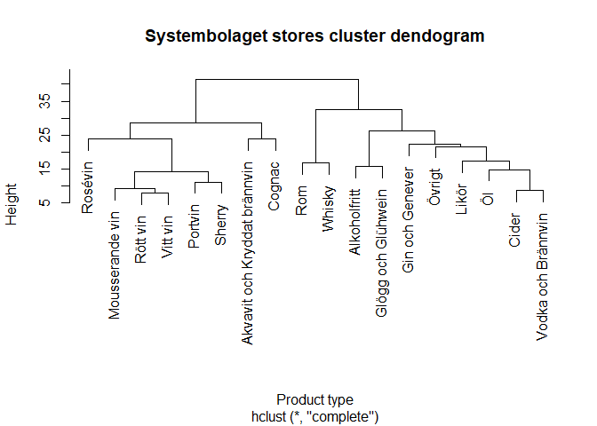

HW4
================

``` r
# Load packages
library(DBI)
library(tidyverse)
```

Systembolaget stores
====================

In the first part of this week's homework we are going to use SQL to query some tables containing data about Systembolaget's stores and assortment. We begin by connecting to the database we are using.

``` r
# Connect to system.sqlite and list tables
con <- dbConnect(RSQLite::SQLite(), "../HW_data/system.sqlite")
dbListTables(con)
```

    ## [1] "stock" "store"

We can see that we have two tables `stock` and `store` in the database. Lets look at tables a little closer.

``` r
# Glimpse at stock table
dbGetQuery(con, "SELECT * FROM stock Limit 20") %>% glimpse()
```

    ## Observations: 20
    ## Variables: 3
    ## $ ButikNr        <chr> "0102", "0102", "0102", "0102", "0102", "0102",...
    ## $ Varugrupp      <chr> "Akvavit och Kryddat brännvin", "Alkoholfritt",...
    ## $ AntalProdukter <int> 21, 61, 29, 14, 17, 18, 31, 118, 14, 16, 32, 38...

``` r
# Glimpse at store table 
dbGetQuery(con, "SELECT * FROM store Limit 20") %>% glimpse()
```

    ## Observations: 20
    ## Variables: 15
    ## $ Typ        <chr> "Butik", "Butik", "Butik", "Butik", "Butik", "Butik...
    ## $ Nr         <chr> "0102", "0104", "0106", "0110", "0113", "0114", "01...
    ## $ Namn       <chr> "Fältöversten", "", "Garnisonen", "", "Sergel", "PK...
    ## $ Address1   <chr> "Karlaplan 13", "Nybrogatan 47", "Karlavägen 100 A"...
    ## $ Address2   <chr> "", "", "", "", "", "", "", "", "", "", "", "", "",...
    ## $ Address3   <chr> "115 20", "114 39", "115 26", "111 57", "111 21", "...
    ## $ Address4   <chr> "STOCKHOLM", "STOCKHOLM", "STOCKHOLM", "STOCKHOLM",...
    ## $ Address5   <chr> "Stockholms län", "Stockholms län", "Stockholms län...
    ## $ Telefon    <chr> "08/662 22 89", "08/662 50 16", "08/662 64 85", "08...
    ## $ ButiksTyp  <chr> "", "", "", "", "", "", "", "", "", "", "", "", "",...
    ## $ Tjanster   <chr> "", "", "", "", "", "Dryckesprovning", "Dryckesprov...
    ## $ SokOrd     <chr> "STOCKHOLM;STHLM;ÖSTERMALM;KARLAPLANSRONDELLEN;FÄLT...
    ## $ Oppettider <chr> "2018-11-22;10:00;19:00;;;0;_*2018-11-23;10:00;19:0...
    ## $ RT90x      <chr> "6582011", "6581802.64", "6581720", "6581443.113", ...
    ## $ RT90y      <chr> "1630064", "1629394.446", "1630377", "1628483.985",...

The first task is to query for a table `butik_ombud` containing the number of stores and agents (`butik` and `ombud`) in each county (as given by `Address5`). For this we are going to use table `store`. Lets write our SQL query.

``` r
# SQL query butik_ombud
butik_ombud <- dbGetQuery(con, "SELECT Address5 as County, Address4 as City, COUNT(*) as Number, Typ as Type 
                          FROM store
                          GROUP BY County, Type
                          ORDER BY County, Type")

# Glimpse at butik_ombud
glimpse(butik_ombud)
```

    ## Observations: 43
    ## Variables: 4
    ## $ County <chr> NA, "Blekinge län", "Blekinge län", "Dalarnas län", "Da...
    ## $ City   <chr> "FÅRÖ", "OLOFSTRÖM", "SÖLVESBORG", "IDRE", "FREDRIKSBER...
    ## $ Number <int> 1, 6, 10, 18, 26, 3, 7, 12, 25, 10, 13, 11, 46, 16, 12,...
    ## $ Type   <chr> "Ombud", "Butik", "Ombud", "Butik", "Ombud", "Butik", "...

Next, the second task is to query for a table `assortment` which contains data on the assortment of different stores. For this task we will need to join the two tables. Lets write the SQL query.

``` r
# SQL query assortment
assortment <- dbGetQuery(con, "SELECT store.Nr as Store, store.Address5 as County, store.Address4 as City,
                         stock.Varugrupp as Product, stock.AntalProdukter as Number
                         FROM store
                         JOIN stock ON store.Nr = stock.ButikNr")

# Glimpse at assortment
glimpse(assortment)
```

    ## Observations: 7,952
    ## Variables: 5
    ## $ Store   <chr> "0102", "0102", "0102", "0102", "0102", "0102", "0102"...
    ## $ County  <chr> "Stockholms län", "Stockholms län", "Stockholms län", ...
    ## $ City    <chr> "STOCKHOLM", "STOCKHOLM", "STOCKHOLM", "STOCKHOLM", "S...
    ## $ Product <chr> "Akvavit och Kryddat brännvin", "Alkoholfritt", "Cider...
    ## $ Number  <int> 21, 61, 29, 14, 17, 18, 31, 118, 14, 16, 32, 388, 12, ...

``` r
# Finally disconnect from database
dbDisconnect(con)
```

We have know completed the SQL part of the homework.

Mapping stores and agents
=========================

In the second part of the homework we will create a choropeth map. In rural areas, stores `(Type == Butik)` tend to be replaced by agents `(Type == Ombud)`. We will illustrate this by computing the ratio of number of stores to the number of agents for each county and visualise the result in a Choropeth. We start by loading the polygon data for the counties of Sweden.

``` r
# Load map data
counties <- read_csv("../HW_data/counties.csv")
```

We then create a new variable called `Ratio` in which we divide the sum of `Butik` by the sum of `Ombud` grouped by `County`.

``` r
# Create new variable Ratio (Butik/Ombud)
butik_ombud_ratio <- butik_ombud %>%  spread(Type, Number) %>%
  mutate(County = replace_na(County, "Gotlands län")) %>%   # Fårö is in Gotlands Län
  group_by(County) %>%
  summarise(Butik = sum(Butik, na.rm = TRUE), Ombud = sum(Ombud, na.rm = TRUE)) %>%
  mutate(Ratio = Butik / Ombud)
```

Finally we can create our choropleth map.

``` r
# Plot choropleth map
butik_ombud_ratio %>% mutate(LnNamn = str_sub(County, 1, -5)) %>%
  right_join(counties, by = "LnNamn") %>%
  ggplot() + geom_polygon(aes(x = long, y = lat, group = group, fill = Ratio)) +
      coord_fixed() +
      theme_bw() +
      labs(title = "Ratio of stores to agents per county")
```



From the map we can see that the rural areas of Sweden often has a store to agent ratio of 1 or below while the more populated areas have a greater store to agent ratio, often above 2.

Product patterns
================

We will start this section by creating a wide version of the `assortment` data frame with columns `Store`, `County`, `City` and one column for each `Product` containing their relative proportions for the store.

``` r
# Create wide data frame for assortment
assortment_wide <- assortment %>% group_by(Store) %>%
  mutate(Number_products = sum(Number)) %>%
  ungroup(Store) %>%
  mutate(Proportion = Number / Number_products) %>%
  select(Store, County, City, Product, Proportion) %>%
  spread(Product, Proportion) %>%
  # Replace missing values with 0 since the store does not have any products in category
  replace(is.na(.), 0)  
```

Let's quickly glimpse at the new data frame `assortment_wide`.

``` r
glimpse(assortment_wide)
```

    ## Observations: 442
    ## Variables: 21
    ## $ Store                          <chr> "0102", "0104", "0106", "0110",...
    ## $ County                         <chr> "Stockholms län", "Stockholms l...
    ## $ City                           <chr> "STOCKHOLM", "STOCKHOLM", "STOC...
    ## $ `Akvavit och Kryddat brännvin` <dbl> 0.014403292, 0.013626374, 0.015...
    ## $ Alkoholfritt                   <dbl> 0.04183813, 0.03604396, 0.04721...
    ## $ Cider                          <dbl> 0.019890261, 0.018021978, 0.020...
    ## $ Cognac                         <dbl> 0.009602195, 0.010989011, 0.011...
    ## $ `Gin och Genever`              <dbl> 0.011659808, 0.009230769, 0.010...
    ## $ `Glögg och Glühwein`           <dbl> 0.012345679, 0.010109890, 0.011...
    ## $ Likör                          <dbl> 0.021262003, 0.021098901, 0.022...
    ## $ `Mousserande vin`              <dbl> 0.08093278, 0.07912088, 0.07786...
    ## $ Portvin                        <dbl> 0.009602195, 0.010109890, 0.010...
    ## $ Rom                            <dbl> 0.010973937, 0.011428571, 0.009...
    ## $ Rosévin                        <dbl> 0.02194787, 0.02813187, 0.02820...
    ## $ `Rött vin`                     <dbl> 0.2661180, 0.2791209, 0.2624157...
    ## $ Sherry                         <dbl> 0.008230453, 0.007912088, 0.008...
    ## $ Whisky                         <dbl> 0.058299040, 0.059780220, 0.063...
    ## $ `Vitt vin`                     <dbl> 0.1714678, 0.1819780, 0.1759657...
    ## $ `Vodka och Brännvin`           <dbl> 0.009602195, 0.009230769, 0.009...
    ## $ Öl                             <dbl> 0.14334705, 0.12571429, 0.12875...
    ## $ Övrigt                         <dbl> 0.08847737, 0.08835165, 0.08645...

We are know going to explore the dataset with clustering to find stores with similar assortments. We start by plotting the first two columns of the *U* matrix in the SVD decomposition of a scaled `assortment_wide` matrix.

``` r
# Rescale proportions
x <- assortment_wide %>% 
  select(-(Store:City)) %>%
  scale()

# Compute SVD and extract the first two columns. Add them to assortment_wide
u12 <- svd(x)$u[, 1:2]   # Compute SVD on x and then extract the first 2 columns
#u2 <- svd(x[, 1:2])$u   # Extract the first two columns from x and then compute SVD
assortment_wide_svd <- assortment_wide %>% mutate(u1 = u12[,1], u2 = u12[,2])

# Plot 
ggplot(assortment_wide_svd, aes(u1, u2)) +
  geom_point() +
  labs(title = "First two left singular vectors of scaled assortment_wide") +
  xlab("First singular left vector, u1") +
  ylab("Second singular left vector, u2")
```



We can clearly see that there are two outliers. We can identify those two stores by running a filter command.

``` r
filter(assortment_wide_svd, u1 > 0.1 & u2 > 0.4) %>% knitr::kable()
```

| Store | County         | City      |  Akvavit och Kryddat brännvin|  Alkoholfritt|      Cider|     Cognac|  Gin och Genever|  Glögg och Glühwein|      Likör|  Mousserande vin|    Portvin|  Rom|    Rosévin|   Rött vin|     Sherry|     Whisky|   Vitt vin|  Vodka och Brännvin|         Öl|     Övrigt|         u1|         u2|
|:------|:---------------|:----------|-----------------------------:|-------------:|----------:|----------:|----------------:|-------------------:|----------:|----------------:|----------:|----:|----------:|----------:|----------:|----------:|----------:|-------------------:|----------:|----------:|----------:|----------:|
| 0110  | Stockholms län | STOCKHOLM |                      0.005042|     0.0756303|  0.0084034|  0.0016807|         0.005042|           0.0134454|  0.0016807|        0.1210084|  0.0117647|    0|  0.0235294|  0.3512605|  0.0100840|  0.0084034|  0.2235294|           0.0033613|  0.0554622|  0.0806723|  0.1790574|  0.4512812|
| 0166  | Stockholms län | STOCKHOLM |                      0.006135|     0.0773006|  0.0085890|  0.0024540|         0.003681|           0.0159509|  0.0000000|        0.1042945|  0.0147239|    0|  0.0331288|  0.3288344|  0.0110429|  0.0073620|  0.2171779|           0.0000000|  0.0797546|  0.0895706|  0.1823453|  0.4589283|

From the table above we can see that the two outliers are stores `0110` and `0166`, both in Stockholm. If we look more closely at these stores we find that they are both very different compared to the other stores when it comes to the assortment. The two stores carry very few products from the categories `Akvavit och Kryddat brännvin`, `Cider`, `Cognac`, `Gin` `Likör`, `Rom`, `Whiskey`, `Vodka och Brännvin` and `Öl`. On the other hand the two stores have lots of products from the product categories `Mousserande vin`, `Portvin`, `Rött vin`, `Sherry` and `Vitt vin`. In conclusion the two stores have a lot of variation in the relative proportions of different product categories.

The next task is to apply clustering to the stores in the plot above. We apply hierarchical clustering with complete linkage (default). The result is shown in the plot below.

``` r
# Cluster observations to 6 clusters with the default complete method
cluster_obs <- dist(x) %>% hclust(method = "complete") %>% cutree(k = 5)

# Plot 
assortment_wide_svd %>% mutate(Cluster = as.character(cluster_obs)) %>%
  ggplot() +
  geom_point(aes(u1, u2, color = Cluster)) +
  labs(title = "First two left singular vectors of scaled assortment_wide colored by cluster") +
  xlab("First singular left vector, u1") +
  ylab("Second singular left vector, u2")
```


The resulting 5 clusters do look somewhat how I imagined they would. Perhaps I thought that cluster 5 would include some other observations than the three that is currently included. Next we can look at the proportions of the product types in the different clusters using a heatmap.

``` r
# Create heatmap
assortment_wide %>%
  select(-c(City, County)) %>% 
  mutate_if(is.numeric, scale) %>%
  mutate(Cluster = cluster_obs, Store = reorder(Store, cluster_obs)) %>% 
  gather(key = key, value = value, -Store) %>%
  ggplot(aes(x = key, y = Store)) + 
    geom_tile(aes(fill = value)) + 
    scale_fill_gradient2() + 
    xlab("Product type") +
    coord_flip() +
    theme(axis.text.x=element_blank(),
      axis.ticks.x=element_blank())
```



Since the heatmap contains so many variables (product types) and observations (stores) it can be difficult to make out exactly how the clusters differ. We will however provide some examples of what is visible from the heatmap. For instance cluster 2, stores 106 and 110, have high proportions of `Mousserande vin`, `Portvin`, `Rött vin`, `Sherry`, `Vitt vin` and low porportions of `Akvavit och Kryddat brännvin`, `Cider`, `Cognac`, `Gin` `Likör`, `Rom`, `Whiskey`, `Vodka och Brännvin`, `Öl`. Cluster 1 is similar to cluster 2 but the differences in proportions between product categories is not as large and the stores in this cluster also have a large proportion of `Rosévin`.

Finally we create a dendogram to visualise the clustering in yet another way.

``` r
# Create dendogram 
t(x) %>% dist() %>% hclust() %>% plot(main = "Systembolaget stores cluster dendogram", 
                                      xlab = "Product type")
```



From the dendogram we can again identify our different clusters just like in the heatmap. The stores in our five clusters are (likely) specialised in the following way.

-   Cluster 1: Rosévin
-   Cluster 2: Mousserande vin, rött vin, vitt vin, portvin, sherry.
-   Cluster 3: Rom och whiskey
-   Cluster 4: Alkoholfritt, glögg och glühwein, gin och genever, övrigt, likör, öl, cidet, vodka och brännvin.
-   Cluster 5: Akvavit och kryddat brännvin, cognac.
