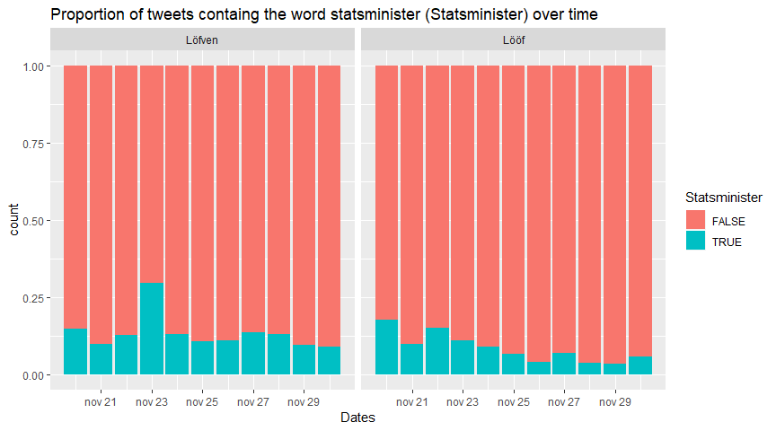
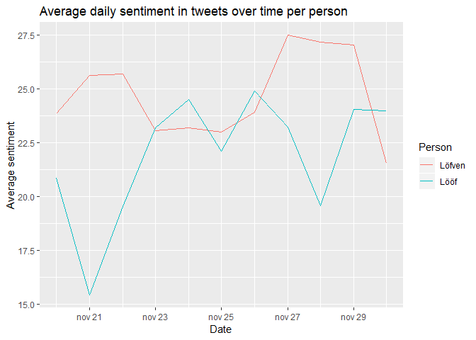
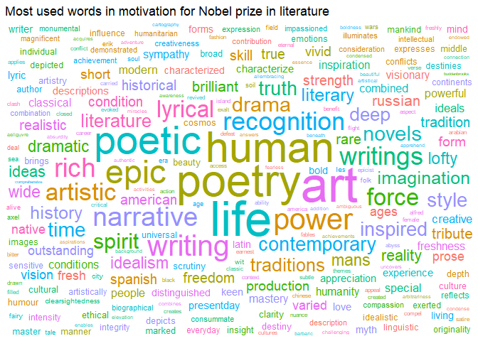

HW5
================

``` r
# Load packages
library(stringr)
library(tidyverse)
library(httr)
library(jsonlite)
library(listviewer)
library(ggwordcloud)
```

Lööf vs Löfven
==============

We start by loading our two data tables.

``` r
# Load data 
load("../HW_data/LoofLofvenTweets.Rdata")
```

The first task is to join the two tables in to one table `tweets` where only non common tweets is included and we should indicate which table each observation is from. We can do this by binding two anti\_join tables together. `Status_id` uniquely identifies each tweet.

``` r
# Create tables 
Loof_table <- anti_join(Loof, Lofven, by = "status_id")
Lofven_table <- anti_join(Lofven, Loof, by = "status_id")

# Bind table to one
tweets <- bind_rows(Loof_table, Lofven_table, .id = "Person") %>% 
    mutate(Person = replace(Person, Person == 1, "Lööf"),
           Person = replace(Person, Person == 2, "Löfven"))
```

The second task to visualise how the intensity of tweets containing the word “statsminister” (or “Statsminister”) has evolved over time for the each `Person`. I am not sure how the word intensity should be interpretated in this context, but I decided to create a bar plot with proportions over time.

``` r
# Plot 
# Proportion of tweets containg the word statsminister (Statsminister) over time

mutate(tweets, Statsminister = str_detect(text, pattern ="statsminister|Statsminister"),
                    Dates = as.Date(created_at)) %>%
  ggplot(aes(Dates, fill = Statsminister)) +
  geom_bar(position = "fill") +
  facet_wrap(~ Person) +
  labs(title = "Proportion of tweets containg the word statsminister (Statsminister) over time")
```



In the final section about tweets we are asked to compute and plot the daily average sentiment of words in the tweet texts for the two `Person`. We start by loading a sentiment lexicon.

``` r
# Read sentiment file to data frame
sentiment <- read_csv("https://svn.spraakdata.gu.se/sb-arkiv/pub/lmf/sentimentlex/sentimentlex.csv")
```

In the sentiment table we are mostly interested in the columns `word` to match to the words in our tweets, and `strength` which is the sentiment strength for a word. Let us split the tweets texts in to a list of character vectors where each word is an element.

``` r
# Create a list of vectors with words as elements  
tweets_words <- tweets$text %>% str_replace_all("[:punct:]", "") %>%  # remove special characters
  str_replace_all("\\s{2,}", " ") %>%  # remove multiple spaces
  str_split(pattern = " ")
```

We are know going to calculate the sentiment scores for each tweet and save them to a vector called `scores`. I decided to write a for loop in (mostly) base R for the sake to practice this. I am sure that there are simpler and faster ways (the two for-loops makes the timecomplexity *n*<sup>2</sup> and the if-statement does not make things better).

``` r
# Create a numeric vector which is full of zeroe
scores <- numeric(length = length(tweets_words))

for (i in 1:length(tweets_words)) {   
  sentiment_score <- 0
  for (j in 1:length(tweets_words[[i]])) {  
    tweet_word <- tweets_words[[i]][[j]]
    if (tweet_word %in% sentiment$word) {
      index <- str_which(sentiment$word, tweet_word)
      sentiment_score <-  sum(sentiment_score, sentiment$strength[index])
    }
  }
  scores[i] <- sentiment_score
}
```

We can then bind the `scores` to the data frame `tweets` and calculate the average daily sentiment.

``` r
# Create new data frame with the average daily sentiment scores per person
avg_daily_sent <- data_frame(scores) %>%
  bind_cols(tweets) %>%
  mutate(Date = as.Date(created_at)) %>%
  group_by(Person, Date) %>%
  summarise(score_avg = sum(scores)/n()) %>% 
  select(Person, Date, score_avg)
```

Finally we will plot the results.

``` r
ggplot(avg_daily_sent, aes(x = Date, y = score_avg, group = Person, colour = Person)) + 
  geom_line() +
  ylab("Average sentiment") +
  labs(title = "Average daily sentiment in tweets over time per person")
```



Nobel API
=========

In the second part of this week's homework we are going to work with data from the Nobel prize api. We start by getting the data from the api as a json file.

``` r
# Get Nobel literature laureates
resp <- GET("http://api.nobelprize.org/v1/prize.json?category=literature")
```

We then need to look at the structure of the .json-file in order to extract the data that we want, note that `jsonedit()` is not visable in github markdown.

``` r
# Look at structure of JSON
literature_json <- content(resp, "text")
jsonedit(literature_json)
```

Let's extract the literature laureates' names and more important the motivations.

``` r
# Extract motivations for laureates and flatten nested list
literature_laureates <- fromJSON(literature_json)$prizes$laureates

motivations <- literature_laureates %>% 
  map("motivation") %>% 
  flatten_chr()
```

We now have the motivations as a character vector `motivations` where each element is a motivation. We need to create a character vector where each word is an element.

``` r
# Extract all word from motivations to a character vector
motivation_words <- motivations %>% 
  str_replace_all("[:punct:]", "") %>%  # remove special characters
  str_replace_all("<I>", "") %>%
  str_flatten(collapse = " ") %>%
  str_replace_all("\\s{2,}", " ") %>%   # remove multiple spaces
  str_to_lower() %>%
  str_split(pattern = " ") %>%
  flatten_chr()   # str_split creates a list
```

Now that we have a character vector `motivation_words` with all the words used in the motivations, it is time to filter out common words that we are not interested in. These are called stop words. We load a file that contains a bunch of stop words.

``` r
# Load stop words
stopwords <- read_table("https://raw.githubusercontent.com/stopwords-iso/stopwords-en/master/stopwords-en.txt",
                       col_names = "words")
```

We then filter out the stop words using `stopwords` from `motivation_words` and create a vector `words` with the words that are left.

``` r
# Filter out stop words and calculate frequency of words left
words <- data_frame(motivation_words) %>%
  filter(!motivation_words %in% stopwords$words) %>%
  group_by(word = as.factor(motivation_words)) %>%
  summarise(freq = n()) %>%
  arrange(desc(freq))
```

At last we can plot the words in a wordcloud where more commonly used words appear larger.

``` r
# Plot
ggplot(words, aes(label = word, 
                  size = freq, 
                  color = factor(sample.int(10, nrow(words), replace = TRUE))),
                  angle = angle) +
  geom_text_wordcloud_area(rm_outside = TRUE) +
  scale_size_area(max_size = 18) +
  theme_minimal() +
  labs(title = "Most used words in motivation for Nobel prize in literature")
```


